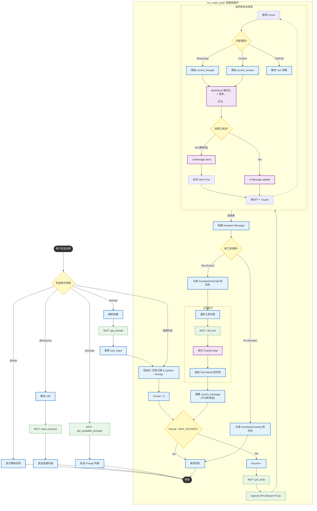
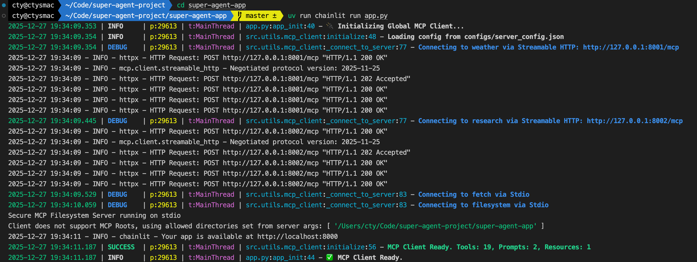
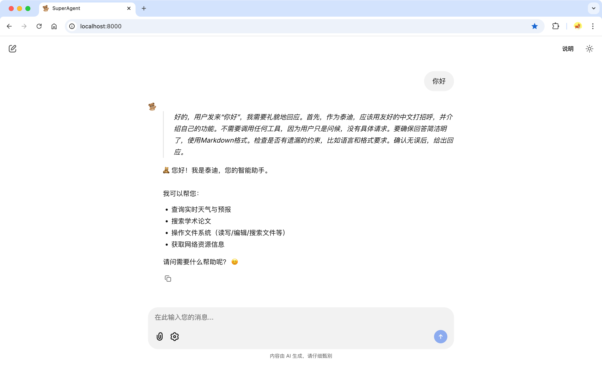
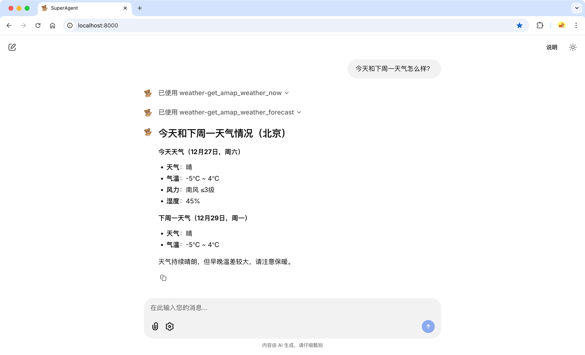
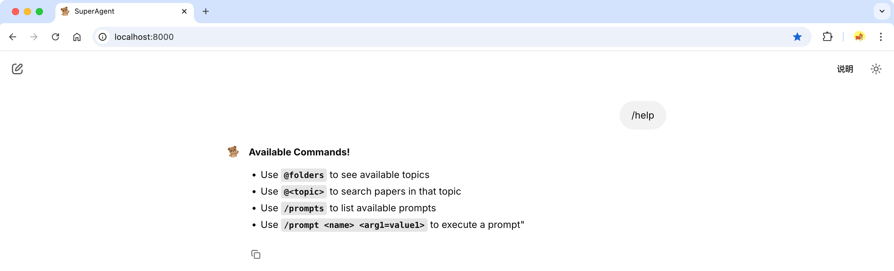
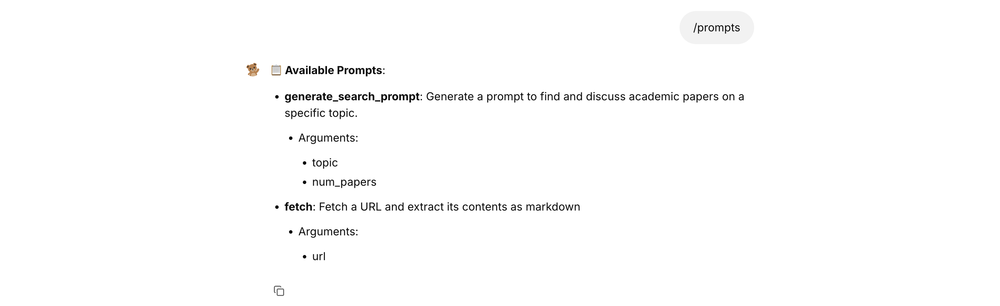
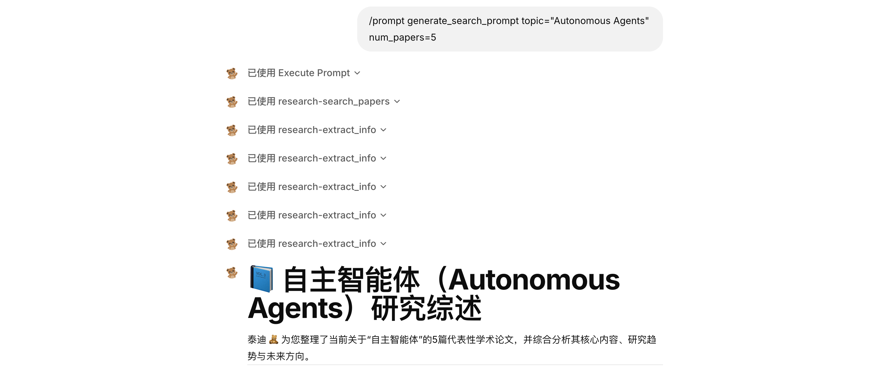
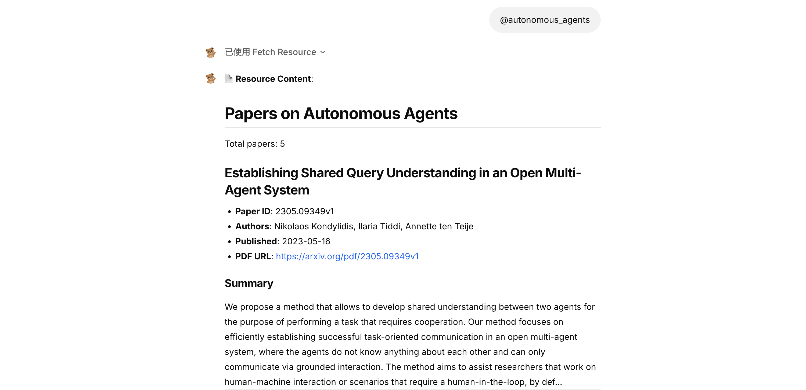

# 🧸 Super Agent

**Slogan**: 打造你的超级 AI 助手！(Build your super AI assistant!)

## 🛠️ 准备环境

### 技术选型

* 编程语言：[Python 3](https://docs.python.org/3/)
* 项目环境和依赖管理：[uv](https://uv.doczh.com/)
* 日志框架：[loguru](https://loguru.readthedocs.io/en/stable/overview.html)
* 单元测试：[pytest](https://docs.pytest.org/en/stable/)
* 项目部署：[docker](https://docs.docker.com/get-started/)
* 模型调用：[OpenAI Python SDK](https://bailian.console.aliyun.com/?spm=a2ty02.30268951.d_model-market.2.67f074a1VkwhFN&tab=api#/api/?type=model&url=2712576)
* AI 应用 UI 框架：[chainlit](https://docs.chainlit.io/get-started/overview)
* 其他依赖随功能迭代继续补充...

### 创建工程

```shell
mkdir super-agent-project && cd super-agent-project
mkdir super-agent-app && cd super-agent-app
```

### 安装依赖

```shell
# 初始化项目
uv init
# 创建虚拟环境（.venv）并添加依赖
uv add loguru pytest pytest-mock openai chainlit
```

**注意❗️**：以上为作者初次安装依赖，其他开发者 clone 项目后，直接在项目路径下运行 `uv sync` 即可。

### 日志策略

* 日志文件路径：logs/app.log
* 日志轮转策略：每周一午夜轮转
* 日志保留策略：6 个月

详见：[src/utils/loguru_utils.py](src/utils/loguru_utils.py)

### 初始化 Chainlit

```shell
chainlit init
```

**注意❗️**：作者已经执行，其他开发者无需再次执行。

### 环境变量

* 作者采用[阿里云百炼平台](https://bailian.console.aliyun.com/?spm=5176.28197581.0.0.12dd29a4fpkfTO&tab=doc#/doc)提供的 LLM 模型服务。
* 执行以下命令前请将 `sk-xxx` 替换为自己的 `API Key`。

```shell
cat > .env << 'EOF'
# 模型配置
OPENAI_BASE_URL=https://dashscope.aliyuncs.com/compatible-mode/v1
OPENAI_API_KEY=sk-xxx
EOF
```

**重要‼️**：一定记得在 `.gitignore` 文件中添加 `.env`，以免将其提交到仓库从而导致 `API Key` 泄露。

### 启动项目

```shell
# 创建新终端，进入项目路径
cd super-agent-app

# 启动项目（开发模式加上 -w 可自动检测代码更新）
uv run chainlit run app.py
```

## 💬 聊天对话：v0.1.0

实现基础的聊天对话功能，支持流式响应、思考模式。

### 相关代码

```text
app.py  # 代码入口
  - start_chat()   # 当用户首次打开聊天时触发，获取并存储模型设置
  - setup_agent()  # 当用户更新设置时触发，更新聊天模型设置
  - main()         # 当用户发送消息时触发，处理用户消息并生成响应

src  # 核心源码
  - agent
      - chat_agent   # 聊天智能体，支持流式和阻塞式响应，支持思考模式
  - ui
      - thinking_ui  # 个性化思考过程 UI 组件
  - utils
      - loguru_utils              # loguru 日志工具
          - config_loguru()           # 初始化日志配置
      - chainlit_utils            # chainlit 工具
          - get_model_settings()      # 获取聊天模型设置，如模型、流式输出、深度思考、角色设定等

public  # 个性化设置
  - favicon.png     # 个性化网页图标
  - logo_light.png  # 浅色主题下的个性化网站 logo
  - logo_dark.png   # 深色主题下的个性化网站 logo
  - theme.json      # 主题设置
      - "--primary": "221.2 83.2% 53.3%"  # 主色调改为蓝色（浅色和深色主题都要改）
      - "--ring": "221.2 83.2% 53.3%"     # 聚焦环改为蓝色（浅色和深色主题都要改）

.chainlit  # chainlit 配置
  - config.toml     # chainlit 配置文件
      - [UI]            # UI 相关配置
          - name = "SuperAgent"               # 设置网站名称
          - default_theme = "light"           # 默认为浅色主题
          - description = "你的超级 AI 助手。"   # 网站描述
          - language = "zh-CN"                # 默认语言为中文
      - [features]      # 功能配置
          - unsafe_allow_html = true          # 消息中启用 HTML 显示（以允许个性化思考过程 UI 样式）
  - translations
      - zh-CN.json  # 中文相关配置
          - watermark   # 修改脚注为“内容由 AI 生成，请仔细甄别”
```

### 对话展示


## 🤖 ReAct 智能体：v0.2.0

实现 ReAct 智能体，通过 MCP（stdio 通信）进行工具调用。

### 相关技术

* **ReAct: Synergizing reasoning and acting in language models** [[arXiv:2210.03629](https://arxiv.org/abs/2210.03629)]
  * 2022 年 10 月由普林斯顿大学和谷歌研究院联合提出的一种融合 LLM 推理和行动的方法，任务的解决轨迹包含多个“思维-动作-观察”步骤。
* **模型上下文协议（[Model Context Protocol，MCP](https://modelcontextprotocol.io/docs/getting-started/intro)）**
  * 由研发 Claude 模型的 Anthropic 公司于 2024 年 11 月提出并开源。该协议旨在标准化 AI 模型与外部数据源及工具的交互方式，方便 AI 应用拓展自身或集成插件生态系统，后续还得到了 OpenAI、谷歌、阿里云等众多企业的支持。

### 新增代码

```text
app.py   # 代码入口
  - app_init()          # 应用启动时执行一次，初始化全局单例 MCP Client
  - app_shutdown()      # 应用关闭时执行一次，清理资源
  - AGENT_MODE          # 全局变量，可选 Agent 模式 "CHAT" 或 "REACT"

configs  # 配置数据
  - server_config.json  # MCP Server 配置
      - weather             # 查询天气服务（Streamable HTTP）
      - research            # 学术研究服务（Streamable HTTP）
      - fetch               # 官方 MCP Server：URL内容提取（Stdio）
      - filesystem          # 官方 MCP Server：文件系统操作（Stdio），注意需要安装 Node.js 环境！

src
  - utils
      - mcp_client   # 定义并维护一个全局 MCP Client 管理器
          - MCPClientManager  # MCP Client 管理器类
              - initialize()              # 从配置文件读取 MCP Server 配置并建立连接
              - _connect_to_server()      # 连接到单个 MCP Server 并建立会话，支持 Stdio, SSE 和 Streamable HTTP 通信协议
              - _register_capabilities()  # 通过会话一次性注册 Tools, Prompts, Resources
              - get_tools_definitions()   # 获取 OpenAI 格式的工具定义
              - call_tool()               # 执行工具
              - get_available_prompts()   # 获取所有可用 Prompt 列表
              - get_prompt()              # 获取 Prompt 模板内容
              - read_resource()           # 读取资源内容
      - chainlit_utils
          - react_model_settings          # ReAct 智能体模型设置
  - agent
      - react_agent  # ReAct 智能体
```

### ReAct 智能体流程图



### 测试对话

**1. 启动 MCP 服务**: [super-agent-mcp-server](https://github.com/super-agent-project/super-agent-mcp-server)

**2. 启动 ReAct 智能体**:

```shell
# new terminal
cd super-agent-app

uv run chainlit run app.py
```



**3. 打招呼 (思考模式)**:



**3. 天气查询**:



**4. 使用提示词模板**:





**5. 查看资源**:



